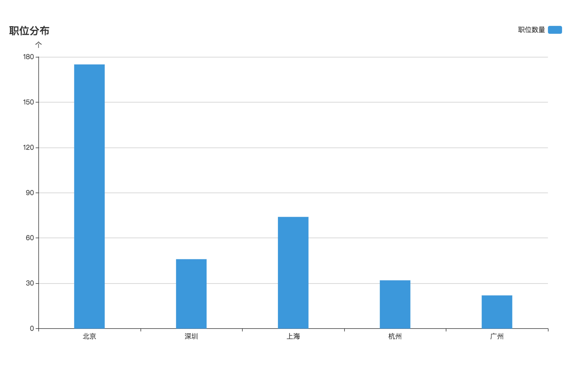
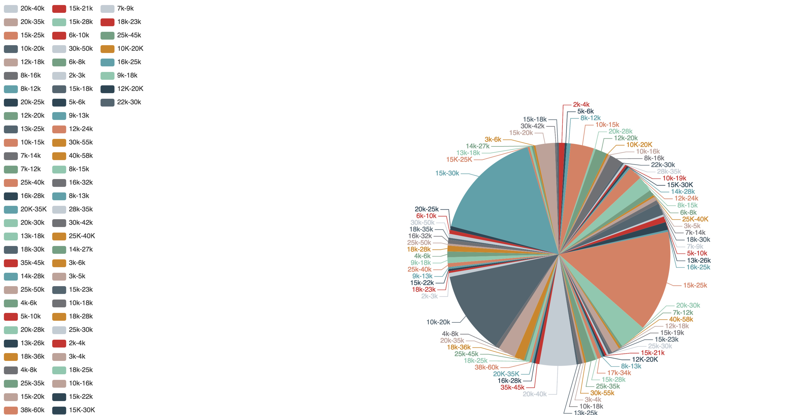

拉钩爬虫出图
==========

[](https://www.python.org/)
[](http://docs.jinkan.org/docs/flask/)
[](http://scrapy-chs.readthedocs.io/zh_CN/0.24/intro/tutorial.html)
[](https://www.crummy.com/software/BeautifulSoup/bs4/doc/index.zh.html)
[](http://docs.python-requests.org/zh_CN/latest/user/quickstart.html)


### 一、关于findjob

- 爬取拉勾devops以及运维开发的数据
- 进行可视化显示
- 目的是为了方便找工作，爬去拉勾数据进行数据可视化展示分析以便找到一个称心如意的工作


### 二、依赖环境

```cpp
pip install -r requirments.txt
```

### 三、具体部署步骤

> 1. 进入项目目录

``` cpp
cd findjob/config/
``` 

> 2.创建数据库lagou,创建表lagou

```cpp
CREATE DATABASE lagou;

CREATE TABLE `jobinfo` (
  `positionId` varchar(255) DEFAULT NULL,
  `positionName` varchar(255) DEFAULT NULL,
  `city` varchar(255) DEFAULT NULL,
  `createTime` varchar(255) DEFAULT NULL,
  `salary` varchar(255) DEFAULT NULL,
  `companyId` varchar(50) DEFAULT NULL,
  `companyName` varchar(255) DEFAULT NULL,
  `companyFullName` varchar(255) DEFAULT NULL,
  `minsalary` double DEFAULT NULL,
  `munsalary` double DEFAULT NULL,
  `maxsalary` double DEFAULT NULL
) ENGINE=InnoDB DEFAULT CHARSET=utf8;
```

> 3.编辑service.conf, 配置数据库地址以及账号密码和flask启动绑定的端口和地址

```cpp
[common]
    mysql_host = 127.0.0.1
    mysql_port = 3306
    mysql_user = root
    mysql_passwd = 123456
    mysql_db = lagou
    mysql_charset = utf8
    passport_key = 123456
[web]
    bind = 0.0.0.0
    port = 8000
```


### 四、如何访问

```cpp

1.cd lagou
2.scrapy crawl lagou
3.cd lagou/runweb
4.python runweb.py
5.访问http://IP:8000/jobstomoney && 访问http://IP:8000/jobstocity
```

### 五、版权

代码内容采用 [新 BSD 许可](LICENSE)
文档内容采用 [署名-禁止演绎 4.0 国际协议许可](https://creativecommons.org/licenses/by-nd/4.0/deed.zh)

### 六、TODO

- [ ] 集成BOSS直聘等平台数据，进行综合评测
- [ ] 针对不同的岗位可进行筛选操作

### 七、鸣谢

- 核心代码贡献者: 国内大型互联网公司首席扛服务器工程师－－刘老师
- 场景的需求才会让这个项目诞生


### 八、Demo




### 九、特别提示

- 本项目仅做沟通交流使用，请勿用作非法用途，谢谢
- 欢迎大家提pr
